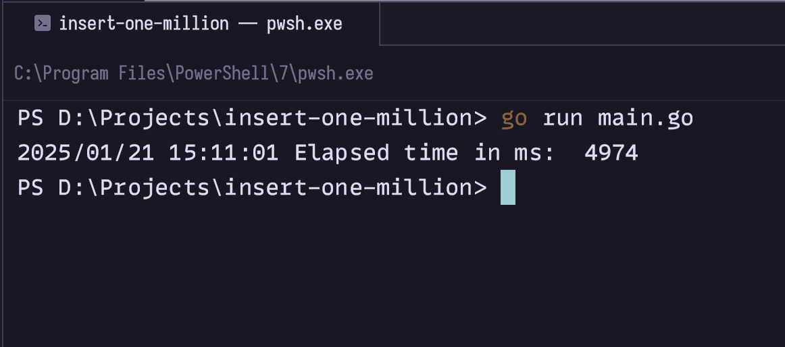

# insert-one-million
Study case from [Dasar Pemrograman Golang by Noval Agung](https://dasarpemrogramangolang.novalagung.com/D-insert-1mil-csv-record-into-db-in-a-minute.html). Concurrently inserts a million rows from a CSV file into a PostgreSQL table using Go.

